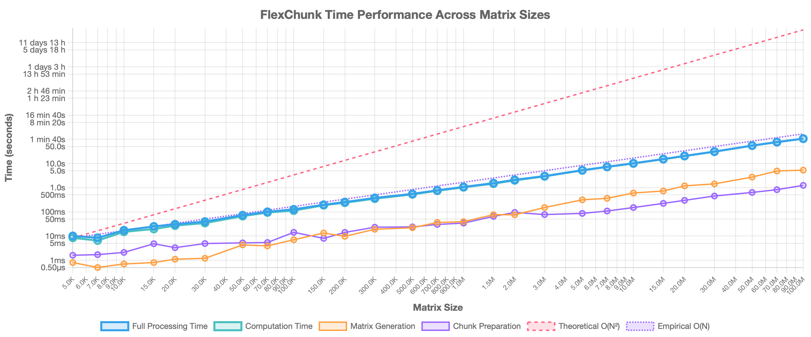
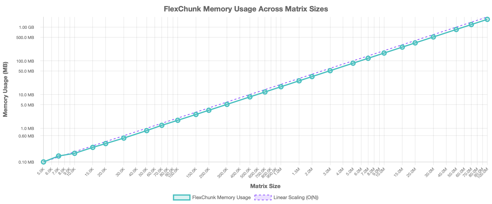

# FlexChunk: Out-of-Core SpMV with Near-Linear Scaling (~1.7 GB for 100M×100M)

FlexChunk is an algorithm for processing large sparse matrices that exceed available RAM. By dividing the matrix into manageable horizontal chunks and processing them sequentially, FlexChunk enables sparse matrix-vector multiplication (SpMV) operations on extremely large matrices using minimal memory. [Try the interactive demo](https://huggingface.co/spaces/DanielSwift/FlexChunk) to see it in action!

## Key Features

- **Out-of-Core Processing**: Operates on matrices too large to fit in RAM
- **Near-Linear Time Complexity**: Approximately O(N) rather than the theoretical O(N²)
- **Linear Memory Consumption**: Memory usage scales linearly with matrix size
- **Large Matrix Support**: Processes massive matrices with minimal memory (~1.7 GB for 100M×100M)
- **Disk I/O Optimization**: Faster data loading compared to traditional approaches

## Interactive Demo

Try out FlexChunk directly in your browser:

🚀 **[FlexChunk Interactive Demo on Hugging Face](https://huggingface.co/spaces/DanielSwift/FlexChunk)**

The demo allows you to:
- Compare FlexChunk with SciPy (Standard Mode)
- Test extremely large matrices (Advanced Mode)
- Visualize memory usage and performance differences
- Experiment with different matrix properties and chunk counts

## Performance Highlights

- **Time Scaling**: The total execution time scales almost linearly with matrix dimension
- **Memory Efficiency**: Peak RAM usage remains low (1.7 GB for 100M×100M matrix)
- **Trade-off**: While SciPy offers faster computation for in-memory matrices, FlexChunk performs better when disk I/O is involved or when matrix size exceeds RAM

### Performance Graphs

#### Time Performance


#### Memory Usage


## How It Works

FlexChunk works in three main stages:

1. **Matrix Generation**: Creates a sparse matrix in CSR format
2. **Chunk Preparation**: Divides the matrix into horizontal slices saved to disk
3. **Computation**: Sequentially loads chunks into memory, multiplies them by the vector, and accumulates partial results

The core insight is that only parts of the matrix are needed in memory at any given time for SpMV operations, allowing processing of matrices that would otherwise be impossible to handle with standard in-memory approaches.

## Code Structure

The repository contains three main Python files:

- **flex_chunk.py**: Core data structure for representing and processing matrix chunks
- **matrix_multiply.py**: Algorithms for chunking, loading, and multiplying matrices
- **test_vs_scipy.py**: Benchmarking and comparison with SciPy's sparse matrix implementation

## Usage Example

```python
import numpy as np
import scipy.sparse as sparse
from matrix_multiply import prepare_chunks, process_matrix_file

# Generate a sparse matrix
M, N = 10_000, 10_000
density = 0.001
matrix = sparse.random(M, N, density=density, format="csr")
vector = np.random.rand(N)

# Prepare chunks
storage_dir = "matrix_chunks"
num_chunks = 20
chunks = prepare_chunks(matrix, num_chunks, storage_dir, verbose=True)

# Perform matrix-vector multiplication
result = process_matrix_file(storage_dir, vector, verbose=True)
```

## Running Tests and Benchmarks

The repository includes a comprehensive testing script that allows you to compare FlexChunk with SciPy's implementation and run benchmarks on matrices of different sizes.

```bash
# Basic test on a medium-sized matrix (will compare with SciPy)
python test_vs_scipy.py --size 10000 --density 0.001 --chunks 10 --storage-dir ./chunks_test

# Test on a larger matrix
python test_vs_scipy.py --size 100000 --density 0.0001 --chunks 20 --storage-dir ./chunks_test

# Test on a very large matrix (skipping SciPy comparison as it would be too memory-intensive)
python test_vs_scipy.py --size 10000000 --density 0.000001 --chunks 100 --storage-dir ./chunks_test --skip-scipy

# For the extreme 100M×100M case (warning: may take a while)
python test_vs_scipy.py --size 100000000 --density 0.00000001 --chunks 1000 --storage-dir ./chunks_test --skip-scipy
```

Additional parameters:
* `--challenging`: Generate a challenging matrix with extreme values
* `--seed VALUE`: Use a specific random seed for reproducibility

## Experimental Results

Our experiments demonstrate that FlexChunk achieves effective performance on extremely large matrices:

| Matrix Size        | Non-zero Elements | Total Time      | Peak RAM Usage |
|--------------------|-------------------|-----------------|----------------|
| 5.0K × 5.0K        | 5.0K              | 10.10 ms        | 0.10 MB        |
| 7.0K × 7.0K        | 8.3K              | 8.40 ms         | 0.15 MB        |
| 10.0K × 10.0K      | 12.0K             | 17.30 ms        | 0.18 MB        |
| 15.0K × 15.0K      | 18.0K             | 24.90 ms        | 0.27 MB        |
| 20.0K × 20.0K      | 24.0K             | 30.60 ms        | 0.35 MB        |
| 30.0K × 30.0K      | 36.0K             | 39.60 ms        | 0.51 MB        |
| 50.0K × 50.0K      | 62.5K             | 72.90 ms        | 0.85 MB        |
| 70.0K × 70.0K      | 88.2K             | 100.30 ms       | 1.22 MB        |
| 100.0K × 100.0K    | 120.0K            | 127.00 ms       | 1.72 MB        |
| 150.0K × 150.0K    | 180.0K            | 196.50 ms       | 2.56 MB        |
| 200.0K × 200.0K    | 240.0K            | 254.00 ms       | 3.41 MB        |
| 300.0K × 300.0K    | 360.0K            | 376.80 ms       | 5.10 MB        |
| 500.0K × 500.0K    | 625.0K            | 554.80 ms       | 8.50 MB        |
| 700.0K × 700.0K    | 882.0K            | 777.10 ms       | 11.90 MB       |
| 1.0M × 1.0M        | 1.2M              | 1.07 s          | 17.00 MB       |
| 1.5M × 1.5M        | 1.8M              | 1.54 s          | 25.50 MB       |
| 2.0M × 2.0M        | 2.4M              | 2.11 s          | 34.00 MB       |
| 3.0M × 3.0M        | 3.6M              | 3.02 s          | 51.00 MB       |
| 5.0M × 5.0M        | 6.2M              | 5.28 s          | 85.00 MB       |
| 7.0M × 7.0M        | 8.8M              | 7.31 s          | 119.00 MB      |
| 10.0M × 10.0M      | 12.0M             | 10.21 s         | 170.00 MB      |
| 15.0M × 15.0M      | 18.0M             | 15.26 s         | 255.00 MB      |
| 20.0M × 20.0M      | 24.0M             | 20.59 s         | 340.00 MB      |
| 30.0M × 30.0M      | 36.0M             | 31.13 s         | 510.00 MB      |
| 50.0M × 50.0M      | 62.5M             | 55.27 s         | 850.00 MB      |
| 70.0M × 7.0M       | 88.2M             | 1 min 17.1 s    | 1.19 GB        |
| 100.0M × 100.0M    | 120.0M            | 1 min 47.1 s    | 1.70 GB        |

The empirical complexity follows a near-linear relationship `time ∝ O(N)`, which is better than the theoretical O(N²) complexity for matrix operations of this scale.

## Why It Matters

FlexChunk enables computations that were previously challenging due to memory limitations. By approaching the problem with empirical scaling in mind, we've created an algorithm that can process matrices at scales that traditional approaches struggle with.

## Technical Details

For more detailed explanations, benchmark methodology, and insights, read our [technical article](https://www.lesswrong.com/posts/zpRhsdDkWygTDScxb/flexchunk-enabling-100m-100m-out-of-core-spmv-1-8-min-1-7-gb).

## System Requirements

Tested with:
- Python 3.12.7
- NumPy 1.26.3
- SciPy 1.12.0
- Numba 0.61.0

Hardware used for benchmarks:
- CPU: Apple M4 Pro
- RAM: 64 GB
- OS: macOS (Darwin 24.3.0)

For detailed methodology and complete results, please refer to the original paper. 